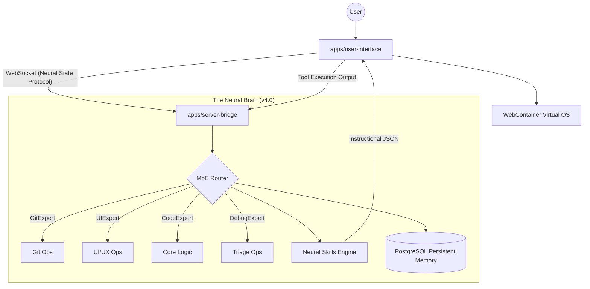

# 🧠 Vibe Hub — Autonomous Neural Swarm Platform (v4.0)

> A production-grade, browser-native IDE powered by a server-side Mixture-of-Experts (MoE) Neural Swarm.
> The Brain thinks. The Swarm executes. The IDE visualizes.

[](https://render.com)
[](LICENSE)
[](CHANGELOG.md)

---

## 🏛️ Vibe Neural Architecture

Vibe Hub uses a high-fidelity **Distributed Bridge Pattern** to ensure absolute security and world-class performance.



### 🧠 Neural Swarm Features
- **Mixture of Experts**: Hybrid routing using L1 (Regex) and L2 (LLM) to dispatch tasks to specialized agent personas.
- **Neural State Protocol**: Real-time streaming of agent mental states: `thinking`, `analyzing`, `writing`, `verifying`.
- **Anti-Hallucination Protocol**: Enforced "Panic Protocol" that prevents agents from guessing file paths or function signatures.
- **Surgical Edit Engine**: 100% precision with `search/replace` blocks, avoiding full file overwrites.
- **Recursive Self-Correction**: Deep 5-pass loops for `npm run build` verification in the browser.

---

## 📂 Project Structure (Monorepo)

```
vibe-hub/
├── apps/
│   ├── server-bridge/       ← THE BRAIN (System-Critical)
│   │   ├── orchestrator/    ← MoE & Neural Logic
│   │   ├── auth/           ← Google & GitHub OAuth
│   │   ├── db/             ← PostgreSQL / Prisma
│   │   └── memory/         ← Neural Journal persistence
│   └── user-interface/      ← THE COCKPIT (PWA)
│       ├── src/
│       │   ├── pages/       ← Workspace & Landing v4.1
│       │   ├── components/  ← AgentStatus & Terminal Mockup
│       │   ├── vfs/         ← WebContainer Orchestration
│       │   └── hooks/       ← Neural State Listening
├── docs/
│   ├── SRS.md               ← Software Requirements
│   ├── TECHNICAL_DOC.md     ← Architectural Deep Dive
│   └── memory.md.template   ← Human-Brain Instruction Template
├── .github/                 ← CI/CD (Swarm Deployment)
└── render.yaml              ← Infrastructure as Code
```

---

## 🚀 Quick Start (Development)

### 1. Prerequisite
- Node.js 20+
- PostgreSQL instance (local or Cloud)
- Gemini API Key

### 2. Installation
```bash
git clone https://github.com/vibe-platform/vibe-hub.git
cd vibe-hub
npm install
```

### 3. Environment Set-up
Create `apps/server-bridge/.env` based on `.env.example`:
```env
DATABASE_URL="postgresql://..."
GEMINI_API_KEY="...-..."
JWT_SECRET="...-..."
```

### 4. Launch
```bash
npm run dev
```
The Neural Brain starts at `:3001` and the IDE Cockpit at `:5173`.

---

## 🛡️ Security
- **Credential Isolation**: API keys NEVER touch the client browser.
- **Sandbox Execution**: All code runs in a secure, isolated WebContainer.
- **JWT Auth**: Every neural state change is authenticated via server-side middleware.

---

## 📄 Documentation
- [Software Requirements (SRS)](docs/SRS.md)
- [Technical Deep Dive](docs/TECHNICAL_DOC.md)
- [Neural Memory Guide](docs/memory.md.template)

---

MIT © 2026 Vibe Hub Engineering
