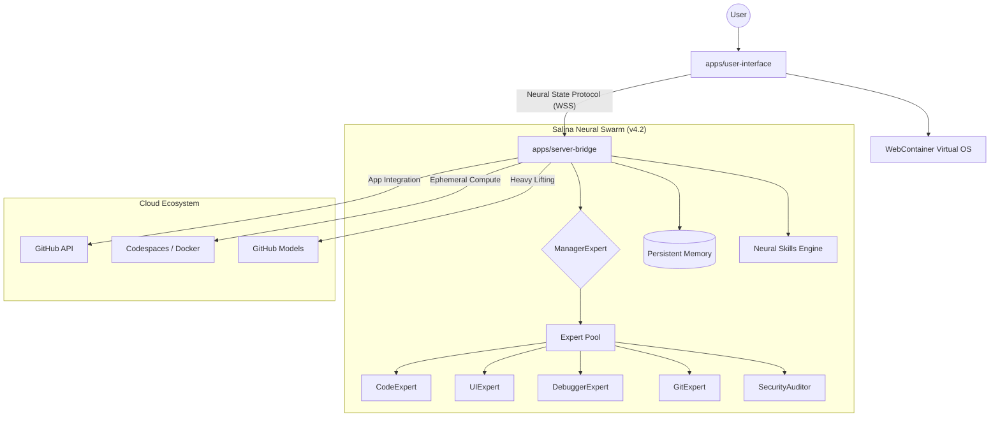

# 🧠 Vibe Hub aka Salina — The Autonomous Neural Swarm (v4.2)

> **Salina** is not just an IDE—it's a cloud-native, reasoning-first engineering swarm that lives in your browser and executes in the cloud. 
> The Brain thinks. The Swarm executes. The Security audits.

[](https://github.com/vibe-platform/vibe-hub)
[](https://render.com)
[](CHANGELOG.md)

---

## 🏛️ The Salina Architecture: "The Distributed Brain"

Salina utilizes a high-fidelity **Neural Bridge** to connect a browser-native workspace with a server-side Mixture-of-Experts (MoE) swarm and cloud-native GitHub infrastructure.


```mermaid
graph TD
    User((User)) --> Cockpit[apps/user-interface]
    Cockpit -- "Neural State Protocol (WSS)" --> Brain[apps/server-bridge]
    
    subgraph "Salina Neural Swarm (v4.2)"
        Brain --> Manager{ManagerExpert}
        Manager --> Experts[Expert Pool]
        Experts --> CE[CodeExpert]
        Experts --> UE[UIExpert]
        Experts --> DE[DebuggerExpert]
        Experts --> GE[GitExpert]
        Experts --> SE[SecurityAuditor]
        
        Brain --> Memory[(Persistent Memory)]
        Brain --> Skills[Neural Skills Engine]
    end
    
    subgraph "Cloud Ecosystem"
        Brain -- "App Integration" --> GH[GitHub API]
        Brain -- "Ephemeral Compute" --> CS[Codespaces / Docker]
        Brain -- "Heavy Lifting" --> GHM[GitHub Models]
    end
    
    Cockpit --> WC[WebContainer Virtual OS]
```

---

## 🚀 Key Evolutionary Features

### 🐙 GitHub-Native Intelligence
Salina is deeply integrated into the GitHub lifecycle, transforming your repository into an active development partner:
- **GitHub App Foundation**: Secure, installation-level authentication for all repository operations.
- **Automated PR Management**: Salina can autonomously branch, commit, push, and open Pull Requests with detailed implementation reports.
- **GitHub Models Integration**: Access to premium LLMs (GPT-4o, Llama 3) for "Heavy Brain" tasks via the GitHub Models API—at zero extra cost.
- **Codespaces Orchestration**: Offload intensive builds or integration tests to ephemeral cloud sandboxes (Cloud Sandboxing Protocol).

### 🤖 The Multi-Agent Swarm
Unlike simple chatbots, Salina uses a **Mixture of Experts**:
- **ManagerExpert**: The "Project Lead" that decomposes complex goals into sub-tasks.
- **SecurityAuditor (Red Team)**: A dedicated security expert that probes your code for vulnerabilities using real tools (Semgrep, ZAP).
- **ReviewerExpert**: An adversarial auditor that verifies every AI-generated line before it reaches your VFS.

### 🔌 Model Context Protocol (MCP)
Salina exposes its internal tools to the world. You can connect external assistants (like Claude Desktop) to Salina’s brain to perform symbolic code searches or request cloud builds via a standardized protocol.

### 🛡️ Cyber-Security Swarm (v4.2)
Salina now features a **Cyber-Security Sandbox**. It can spin up ephemeral Docker containers to run SAST/DAST scans against your project, identify vulnerabilities, and autonomously implement hardening patches.

---

## 💡 How to Unlock Highest Value

Treat Salina as a **delegated engineering partner**, not a snippet generator.

1.  **Give Complex, Multi-File Goals**: The ManagerExpert thrives on "Add auth with JWT" style requests.
2.  **Let it Self-Correct**: The ReAct loop allows Salina to recover from build errors and failed tests without your help.
3.  **Teach it Once, Remember Forever**: Use the **Brain Journal** to teach Salina your project's specific coding standards.
4.  **Lean on Git Safety**: Every edit is an atomic search/replace block with an automatic **Git Checkpoint** for instant rollback.

---

## 📂 Project Structure (Monorepo)

```
vibe-hub/
├── apps/
│   ├── server-bridge/       ← THE BRAIN (MoE Swarm & GitHub Bridge)
│   │   ├── orchestrator/    ← Neural Logic & Expert pool
│   │   ├── github/          ← App & Codespaces integration
│   │   └── sandbox/         ← Ephemeral Security Containers
│   └── user-interface/      ← THE COCKPIT (Next.js IDE)
│       ├── src/vfs/         ← WebContainer Orchestration
│       └── src/hooks/       ← Neural State Bridge
├── Dockerfile.security      ← Cyber-Range image
└── render.yaml              ← Infrastructure as Code
```

---

## 📄 Documentation
- [Neural Memory Guide](docs/memory.md.template)
- [Architectural Deep Dive](docs/TECHNICAL_DOC.md)
- [Cyber-Security Protocol](docs/security.md)

---

MIT © 2026 **Vibe Hub Engineering** | *Salina is watching your back.*
