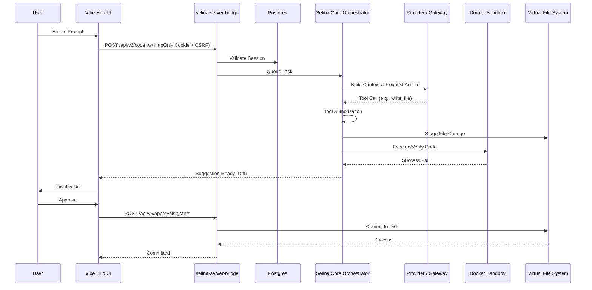

# Runtime Flow

This document outlines the actual lifecycle of a request in Vibe Hub / Selina Core.

## 1. Frontend Startup
When the Vibe Hub frontend initializes:
1.  **API Base Resolution:** `VITE_API_BASE` resolves the backend location (`selina-server-bridge`).
2.  **Session Resolution:** The frontend calls `/api/auth/status` (via `ApiClient.authStatus`) to check if a valid HttpOnly cookie session exists.
3.  **Auth State:** If authenticated, user details are loaded. If not, an auto-refresh attempt is made before falling back to an unauthenticated state.
4.  **Protected Routing:** Protected views (like the main workspace) redirect to login if unauthenticated.
5.  **Backend Readiness:** The frontend may query `/health` or `/api/runtime/brand` to verify the control plane is online.

## 2. Auth Flow (Production)
The production auth model is **HttpOnly-cookie-first**. Browser-visible tokens are not the production standard.
1.  **OAuth Initiation:** User clicks Google/GitHub login. The UI redirects to `/api/auth/google` or `/api/auth/github` with a `returnOrigin`.
2.  **Provider Callback:** The provider redirects back to the backend callback endpoint.
3.  **Handoff/Session Creation:** The backend exchanges the provider code, creates a user record in Postgres, and sets a secure HttpOnly session cookie.
4.  **CSRF Token:** The frontend fetches a CSRF token from `/api/csrf-token` to use in subsequent state-changing `POST` requests.
5.  **Split-Origin Behavior:** Because the frontend and backend are often on different domains (e.g., Vercel and Render), cookies require `SameSite=None; Secure`.
6.  **Revocation:** `/logout`, `/logout-all`, and `/sessions/:id/revoke` endpoints clear the session from Postgres and invalidate the cookie.

## 3. Prompt Execution Flow (Canonical Path)
The execution of a user prompt to a final code change follows this path:

1.  **Frontend Request:** User submits a prompt via the UI.
2.  **API Ingress:** Request hits `/api/code` or `/api/v6/code`.
3.  **Validation:**
    *   Auth check (valid session).
    *   CSRF validation.
    *   Schema validation.
4.  **Job Queue:** The request is queued via the Task Manager / Queue if concurrency limits apply.
5.  **Orchestrator & Routing:** `BrainSystemOrchestrator` receives the task.
6.  **Expert Loop:**
    *   The prompt is routed to the appropriate Expert (e.g., `CodeExpert`).
    *   Context is built (memory, AST, linked repos).
7.  **LLM Call:** The expert uses `selina-router.js` to call the LLM (FreeLLMAPI or direct provider) with available MCP tools.
8.  **Tool Authorization:** If the LLM requests a tool (e.g., write to file), `validateToolInvocationPolicy` and `authorizeToolCall` ensure the action is safe and granted.
9.  **Sandbox Verification:** If code execution is required, it runs in the Local Docker Sandbox.
10. **VFS Staging:** Proposed file changes are written to the Virtual File System (VFS), marked as pending.
11. **Approval Grant:** The frontend displays a diff. The user must explicitly approve the change.
12. **Commit:** Upon approval (`/api/v6/approvals/grants`), the VFS commits the change to disk/repo.

## 4. Coexistence of Orchestration Systems
The system evolved and currently contains multiple orchestration components working together:
*   **Expert Loop:** The primary execution unit for a specific domain (e.g., Code, Debug).
*   **XState Machine:** Manages complex, multi-step Directed Acyclic Graphs (DAGs) for Layer 4 validation and convergence.
*   **BrainSystemOrchestrator:** The top-level manager that handles the WebSocket connection, queues, and dispatches to experts.
*   **Router (`selina-router.js`):** Routes LLM calls based on provider health, capabilities, and rate limits.
*   **Reviewers / Security Gate:** Specialized agents that audit proposed changes before they leave the loop.
*   **Rollout Recorder:** Persists execution steps and state for durability and UI visualization.

## 5. Path Classifications
*   **Primary Production Path:** Expert Loop -> Router -> LLM -> Tool Auth -> VFS Staging -> User Approval -> Commit.
*   **Compatibility Path:** Legacy token endpoints.
*   **Experimental Path:** Custom MCP server registration via UI.
*   **Legacy Path:** Direct API calls that bypass the queue/orchestrator (if any exist).

## 6. Failure & Retry Model
*   **Build Failure:** The orchestrator catches the exit code, feeds the `stderr` back to the LLM, and retries (up to a limit based on `effortLevel`).
*   **LLM Provider Failure:** The router catches rate limits or 500s and can switch providers or fallback if configured.
*   **Missing Env:** Triggers an immediate 500 or process exit during startup.
*   **Sandbox Failure:** Treated as a build failure; feedback loops back to the LLM.
*   **Session Revocation:** API calls return 401. Frontend intercepts, clears local state, and redirects to login.
*   **Redis Unavailable:** If configured but unreachable, multi-instance coordination fails. (Graceful degradation to single-instance only if Redis URL is absent).
*   **Postgres Unavailable:** Fatal error. Auth and history fail.
*   **CSRF Failure:** Request rejected with 403.
*   **Rate Limit Hit:** Returns 429 Too Many Requests.

## 7. Sequence Diagram

