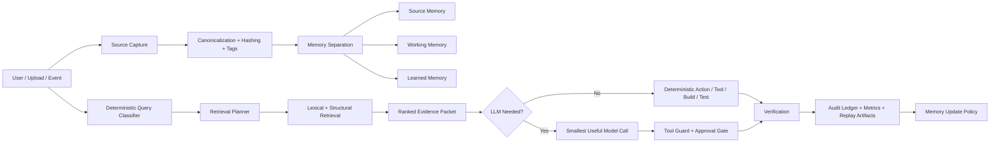
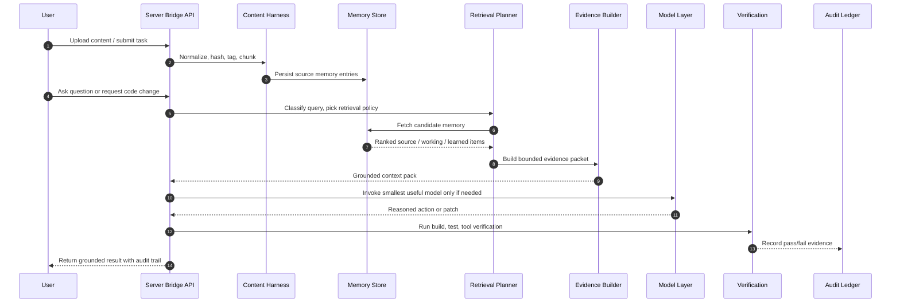
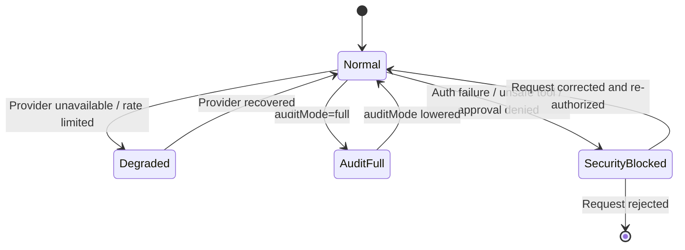

# Dataflow Schema

This document is the repo-level source of truth for how Vibe-Hub moves data through ingestion, retrieval, reasoning, execution, verification, and audit.

GitHub renders Mermaid diagrams well, but it does not provide robust native animation controls. The diagrams below are therefore GitHub-native and static-by-default. If we need motion later, the same graphs can be exported to SVG or GIF in `docs/assets/`.

## End-to-End Flow

## Harnessing And Retrieval Sequence

## Runtime Modes

## Implementation Anchors

- Source capture and canonicalization: `apps/server-bridge/memory/content-harness.js`
- Retrieval planning and evidence packing: `apps/server-bridge/memory/rag-layers.js`
- Memory loading: `apps/server-bridge/memory/loader.js`
- Prompt construction and token budgeting: `apps/server-bridge/orchestrator/context-builder.js`
- Tool gating and orchestration: `apps/server-bridge/orchestrator/index.js`, `apps/server-bridge/mcp/`
- Durable audit artifacts: `apps/server-bridge/orchestrator/rollout_recorder.js`
