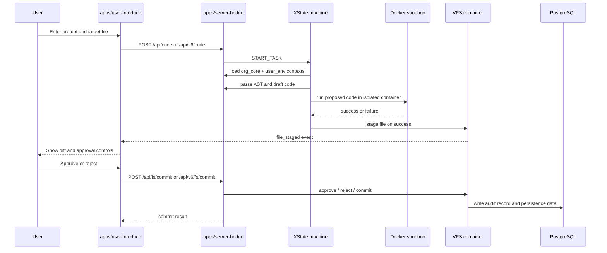

# Vibe-Hub Dataflow Diagram

## Flow Notes

1. The request starts in the UI workspace, not directly in the backend.
2. The server bridge is responsible for both orchestration and the approval gate.
3. The staged file is not written to disk until the user approves the commit.
4. `agent_status` and `file_staged` are the primary real-time events used by the workspace.
