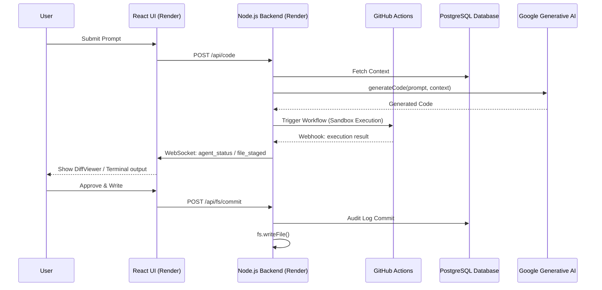

# Vibe Hub Dataflow Diagram

```mermaid
sequenceDiagram
    participant User
    participant Frontend as React UI (Render)
    participant Backend as Node.js Backend (Render)
    participant GHA as GitHub Actions
    participant DB as PostgreSQL Database
    participant LLM as Google Generative AI

    User->>Frontend: Submit Prompt
    Frontend->>Backend: POST /api/code
    Backend->>DB: Fetch Context
    Backend->>LLM: generateCode(prompt, context)
    LLM-->>Backend: Generated Code
    Backend->>GHA: Trigger Workflow (Sandbox Execution)
    GHA-->>Backend: Webhook: execution result
    Backend->>Frontend: WebSocket: agent_status / file_staged
    Frontend-->>User: Show DiffViewer / Terminal output
    User->>Frontend: Approve & Write
    Frontend->>Backend: POST /api/fs/commit
    Backend->>DB: Audit Log Commit
    Backend->>Backend: fs.writeFile()
```
