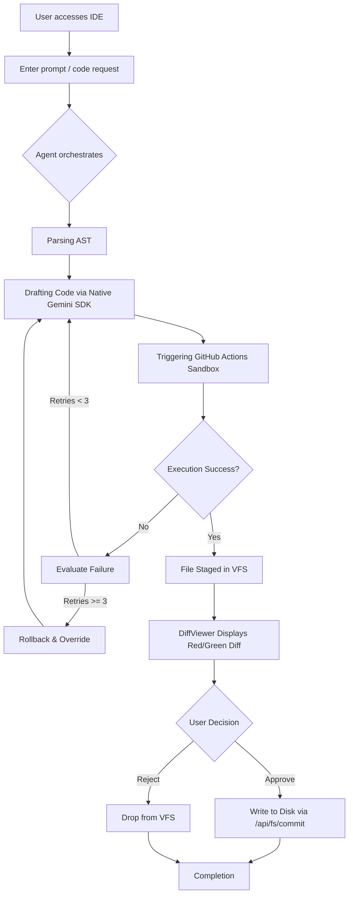

# Vibe Hub User Flow

```mermaid
flowchart TD
    A[User accesses IDE] --> B[Enter prompt / code request]
    B --> C{Agent orchestrates}
    C --> D[Parsing AST]
    D --> E[Drafting Code via Native Gemini SDK]
    E --> F[Triggering GitHub Actions Sandbox]
    F --> G{Execution Success?}
    G -- No --> H[Evaluate Failure]
    H --> |Retries < 3| E
    H --> |Retries >= 3| I[Rollback & Override]
    I --> E
    G -- Yes --> J[File Staged in VFS]
    J --> K[DiffViewer Displays Red/Green Diff]
    K --> L{User Decision}
    L -- Reject --> M[Drop from VFS]
    L -- Approve --> N[Write to Disk via /api/fs/commit]
    N --> O[Completion]
    M --> O
```
