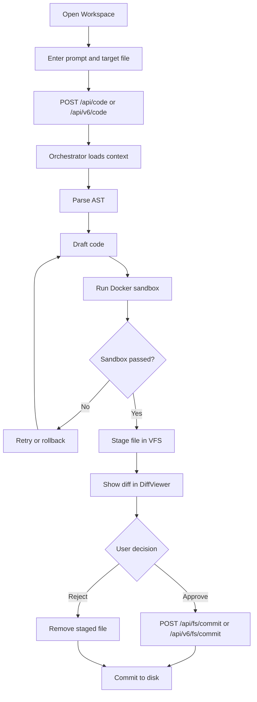

# Vibe Hub User Flow

## Experience Notes

- The user stays in the workspace the whole time; there is no hidden commit path.
- The diff review step is the explicit approval gate.
- Rejected changes disappear from the staged queue.
- Approved changes pass through the VFS container before they touch disk.
